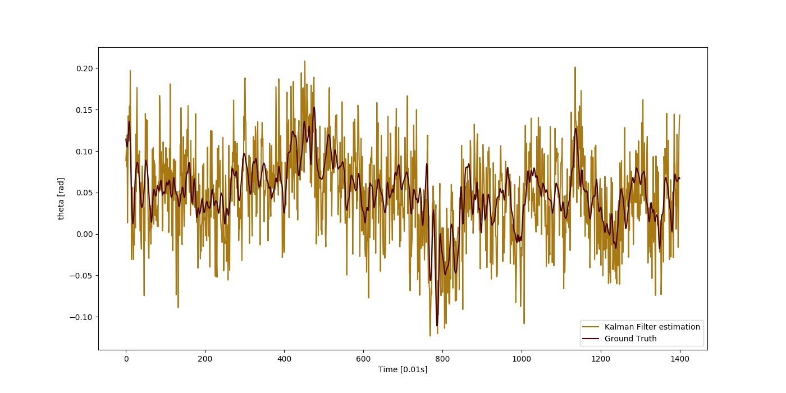

### DANAE

DANAE is a deep Denoising AutoeNcoder for Attitude Estimation which works on Kalman filter IMU/AHRS data integration with the aim of reducing any kind of noise, independently of its nature.

DANAE++ is the enhanced version of the first architecture: it is able to denoise IMU/AHRS data obtained through Linear (LKF) and Extended (EKF) Kalman filter-derived values, obtaining better results also when compared to common low-pass filters (in our study, the Butter LP filter and the Uniform filter both provided by the Scipy library in pytorch).

### Reference
[Conference Paper]: https://arxiv.org/abs/2011.06853 presented @Metrology for the Sea 2020

[Extended Article]: https://www.mdpi.com/1424-8220/21/4/1526 published by Sensors, MDPI - 2021

